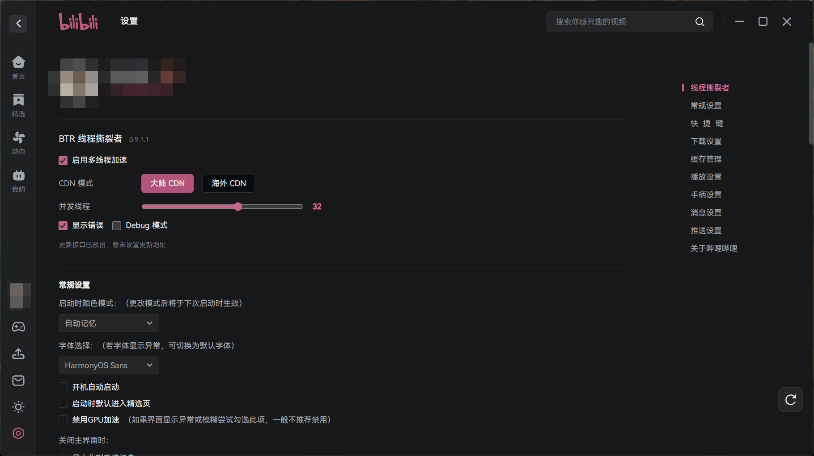
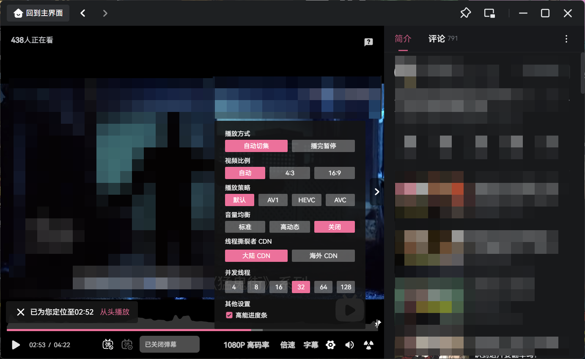

# BTR Desktop

把 Bilibili 线程撕裂者带到官方 Windows 客户端里，原本的播放器、字幕、弹幕和快捷键都保留。

当前版本 **0.9.4.0-d1**，不再限制官方客户端版本，已在官方客户端 **1.18.0** 实测

桌面版的性能相比网页端有一点差距，但依旧相比原生提升明显。更多差异，请参考 [difference.md](difference.md)。


## 安装

1 先安装好官方哔哩哔哩 Windows 客户端

2 右键左下角Windows徽标 选择终端 (Windows11) 或 Powershell (Windows11以前或无终端版版) **不要用管理员身份运行**

3 运行下面的脚本

```powershell
irm https://raw.githubusercontent.com/MrTangLuyao/Bilibili-thread-ripper-desktop/main/install.ps1 | iex
```

这会执行这个仓库中的安装脚本，脚本可直接查看 [install.ps1](install.ps1)

哔哩哔哩没装在默认位置（`C:\Program Files\bilibili`）也没关系，脚本找不到时会让你输入安装文件夹，把 `哔哩哔哩.exe` 拖进窗口再按回车就行

## 强制更新（如遇到更新异常使用脚本更新）：

**部分旧版本会遇到更新问题，请务必使用这个脚本来强制更新**

打开普通 PowerShell，复制这一行运行：

```powershell
irm https://raw.githubusercontent.com/MrTangLuyao/Bilibili-thread-ripper-desktop/main/force-update.ps1 | iex
```

## 设置和更新

系统设置第一项就是线程撕裂者，可以调整 CDN、线程数、错误提示和 Debug。播放器的“齿轮 → 更多播放设置”里也保留 CDN 和线程数，两边同步。

CDN 除了大陆、海外，还可以选“自定义”：在系统设置里勾选已知的服务器，也可以手动添加服务器地址（只接受 B 站自己的视频服务器，最多 32 个）。选了自定义后，BTR 只从你选的服务器下载；一个都没选时按大陆 CDN 下载。播放器菜单里可以切到自定义，服务器列表在系统设置里增减。切换 CDN 或增减服务器不用重新打开视频，从下一段下载开始生效。你选的服务器都下载失败时，和平时一样交回客户端自己下载，不会卡住视频。

默认是大陆 CDN、8 线程（线程数一般推荐 8 到 32，不够流畅再往上加），红色错误提示默认不显示，需要排查时在设置里打开“显示错误”。从旧版升级到 0.9.1.2 时，这三项会统一改成新的默认值一次，之后按你的设置保存。

同一个视频里，某个 CDN 节点两次一点数据都没给（错误提示里显示“已收到 0 KiB”），BTR 就停用这个节点，这个视频接下来不再用它，换视频后恢复。所有节点都被停用时，仍会继续尝试，避免整个视频放不了。如果是 B 站给的某个下载地址一直被服务器拒绝，只停用这个地址，不连累节点；只拿到 akamaized.net 地址的账号也能用多个节点下载。

系统设置：



播放器设置：



自动和手动检查都读取本仓库的 [latest.json](latest.json)。只要完整版本号和仓库不同，就会提示更新。确认后安装，成功后重新打开客户端，不创建 BTR 快捷方式。也可以直接再执行上面那条命令。

如果 d1 或 d2 卡在“正在下载并安装”，请运行上面的强制更新命令。旧版的更新程序可能根本没启动，单纯等待或重复点击不能修好；装上 d3 后才会使用新的进度窗口。d3 和 d4 点更新时，进度窗口会跟着客户端一起消失，但后台仍会装完并重新打开客户端。d3 的卸载会在关闭客户端时被系统一起结束，所以点了没效果；d4 的卸载窗口同样会消失，后台仍会继续执行。0.9.1.1-d5 起这些窗口会一直显示到结束。更新日志保存在 `%LOCALAPPDATA%\BTR_Desktop\logs`，失败时也可以在窗口里直接打开。

更新不要求保留旧配置格式，但不会清空你的 Bilibili 账号和官方客户端数据。

官方客户端平时的自动更新只替换 `%APPDATA%\bilibili` 里的缓存，不会动 BTR，BTR 也不再检查客户端版本号。如果重新下载官方安装包覆盖安装，BTR 会被覆盖，这时后台的 BTR 监视程序会弹窗问你要不要重新接入，确认后关闭客户端、写入 BTR（需要一次管理员授权）再重新打开；也可以直接再运行上面的安装命令。监视程序在当前用户的开机启动项里叫“BTR Desktop”，不常驻窗口，不需要时可以在任务管理器的“启动应用”里关掉。如果新客户端的程序结构 BTR 认不出来，就保持官方客户端不变，不强行注入；播放时加速连续失败，也会自动改回客户端自己的下载。

## 还原

在系统设置的线程撕裂者区域，点击“检查 BTR 更新”右侧红色的 **卸载 BTR**，再确认即可。独立卸载窗口会先检查备份，随后关闭客户端、恢复官方资源并重新打开，不删除账号、缓存和个人设置。卸载不需要连接 GitHub，对应的 BTR 桌面快捷方式和开机启动的监视程序也会移除。遇到失败可以点击“查看卸载日志”，日志保存在 `%LOCALAPPDATA%\BTR_Desktop\logs`。

如果无法进入设置，也可以完全退出客户端后，在安装文件夹运行 `BTR_Desktop.exe remove`。安装文件夹位置记录在 `%LOCALAPPDATA%\BTR_Desktop\current.json`，还原后这条记录和监视程序的启动项会一起清掉。原始备份和本地安装包会保留，不删除仓库代码。

## 开发和发版

修改 `desktop.json` 和 `package.json` 的版本信息，然后运行 `npm run release`。把源码、`dist`、`packages` 和 `latest.json` 一起 commit、push 就行，不需要手工上传 GitHub Release。

下载器仍复用浏览器版代码，桌面差异放在 `src`。不会换掉原生播放器，不接管字幕、登录接口和离线下载。网络和 CDN 状态仍会影响缓冲，不承诺所有视频永不卡顿。

[更新文件说明](docs/update-interface.md) | [验证记录](docs/verification.md)
