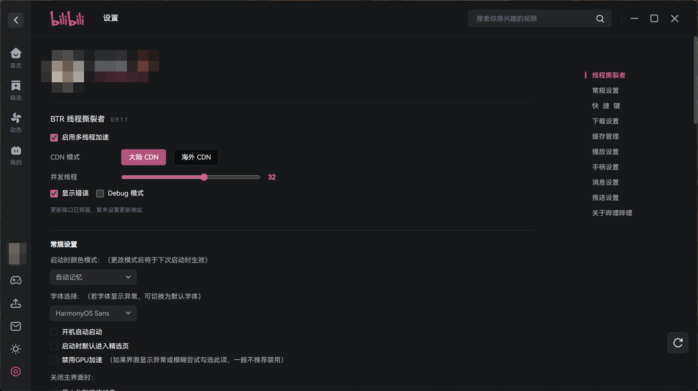
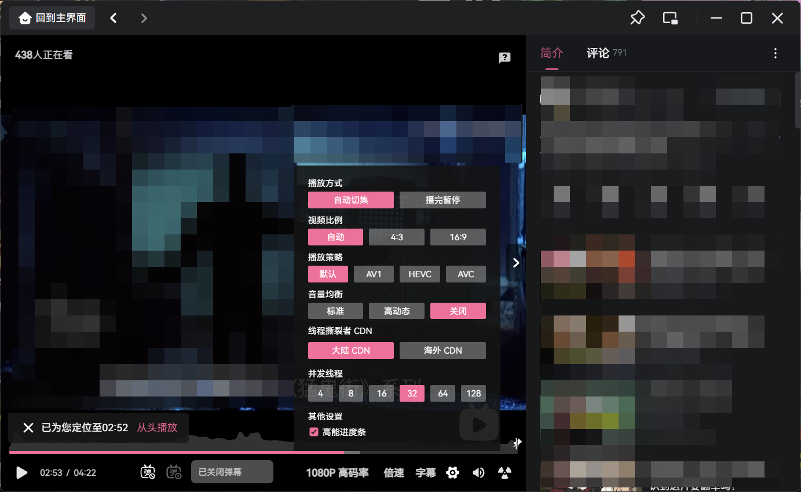

<div align="center">


# BTR Desktop

**Bilibili 线程撕裂者的桌面版，适用于官方哔哩哔哩 Windows 客户端**

把线程撕裂者带到官方 Windows 客户端里，原本的播放器、字幕、弹幕和快捷键都保留

当前版本 **2026.10.7.2-d1** · 已在官方客户端 **1.19.0** 实测

[](#-安装) [](https://github.com/MrTangLuyao/Bilibili-thread-ripper) [](https://github.com/MrTangLuyao/Bilibili-thread-ripper-desktop/stargazers) [](LICENSE)

[**安装**](#-安装) · [强制更新](#-强制更新) · [设置](#️-设置) · [还原](#-还原) · [和网页版的区别](difference.md) · [网页版](https://github.com/MrTangLuyao/Bilibili-thread-ripper)

 

</div>

> [!NOTE]
> 桌面版工作在类似网页版“兼容模式”的方式下：只接管视频下载，播放仍由客户端自己负责，所以效果可能不如网页版，但相比原生依旧提升明显。更多差异请参考 [difference.md](difference.md)。

## ✨ 它能做什么

- **原生客户端不变**：播放器、字幕、弹幕和快捷键都保留，BTR 只接管视频下载
- **一行命令安装**：在 PowerShell 里运行一行命令，自动找到客户端
- **客户端里自动更新**：发现新版本会提示，确认后安装并重新打开客户端
- **不怕官方覆盖安装**：官方安装包覆盖了 BTR 时，后台监视程序会问你要不要重新接入
- **出问题自动退回**：坏节点自动停用；加速连续失败就交回客户端自己下载，不会卡住视频
- **随时一键还原**：设置里点卸载就能恢复官方客户端，不动账号和数据

## 📦 安装

桌面版只支持 Windows。不会有 macOS 版：维护和安装都太困难。Mac 用户请使用 [网页版](https://github.com/MrTangLuyao/Bilibili-thread-ripper)。

1. 先安装好官方哔哩哔哩 Windows 客户端。
2. 右键左下角的 Windows 徽标，选择 **终端**（Windows 11）或 **PowerShell**（更早的 Windows，或者没有终端的版本）。普通权限和管理员身份运行都可以。
3. 运行下面这行命令：

   ```powershell
   irm https://raw.githubusercontent.com/MrTangLuyao/Bilibili-thread-ripper-desktop/main/install.ps1 | iex
   ```

这会执行这个仓库中的安装脚本，脚本内容可以直接查看 [install.ps1](install.ps1)。

> [!TIP]
> 哔哩哔哩没装在默认位置（`C:\Program Files\bilibili`）也没关系：脚本找不到时会让你输入安装文件夹，把 `哔哩哔哩.exe` 拖进窗口再按回车就行。

## 🛟 强制更新

如遇到更新异常，使用这个脚本更新。打开 PowerShell，复制这一行运行：

```powershell
irm https://raw.githubusercontent.com/MrTangLuyao/Bilibili-thread-ripper-desktop/main/force-update.ps1 | iex
```

> [!IMPORTANT]
> 部分旧版本会遇到更新问题，请务必使用这个脚本来强制更新。

## ⚙️ 设置

有两个入口，两边的设置同步：

| 入口 | 可以调整 |
| --- | --- |
| **系统设置** 第一项“线程撕裂者”（页首左图） | CDN、线程数、错误提示和 Debug |
| 播放器 **齿轮 → 更多播放设置**（页首右图） | CDN 和线程数 |

| 设置 | 默认 | 说明 |
| --- | --- | --- |
| CDN 模式 | 大陆 CDN | 也可以选海外或自定义 |
| 线程数 | 8 | 一般推荐 8 到 32，不够流畅再往上加 |
| 显示错误 | 关 | 红色错误提示默认不显示，需要排查时打开 |

从旧版升级到 0.9.1.2 时，这三项会统一改成新的默认值一次，之后按你的设置保存。

**自定义 CDN**：除了大陆、海外，还可以选“自定义”：在系统设置里勾选已知的服务器，也可以手动添加服务器地址（只接受 B 站自己的视频服务器，最多 32 个）。选了自定义后，BTR 只从你选的服务器下载；一个都没选时按大陆 CDN 下载。播放器菜单里可以切到自定义，服务器列表在系统设置里增减。切换 CDN 或增减服务器不用重新打开视频，从下一段下载开始生效。你选的服务器都下载失败时，和平时一样交回客户端自己下载，不会卡住视频。

**坏节点自动停用**：同一个视频里，某个 CDN 节点两次一点数据都没给（错误提示里显示“已收到 0 KiB”），BTR 就停用这个节点，这个视频接下来不再用它，换视频后恢复。所有节点都被停用时，仍会继续尝试，避免整个视频放不了。如果是 B 站给的某个下载地址一直被服务器拒绝，只停用这个地址，不连累节点；只拿到 akamaized.net 地址的账号也能用多个节点下载。

## 🔄 更新

自动和手动检查都读取本仓库的 [latest.json](latest.json)。只要完整版本号和仓库不同，就会提示更新。确认后安装，成功后重新打开客户端，不创建 BTR 快捷方式。也可以直接再执行上面的安装命令。

更新不要求保留旧配置格式，但不会清空你的 Bilibili 账号和官方客户端数据。

### 官方客户端更新以后

官方客户端平时的自动更新只替换 `%APPDATA%\bilibili` 里的缓存，不会动 BTR，BTR 也不再检查客户端版本号。

如果重新下载官方安装包覆盖安装，BTR 会被覆盖。这时后台的 BTR 监视程序会弹窗问你要不要重新接入，确认后关闭客户端、写入 BTR（需要一次管理员授权）再重新打开；也可以直接再运行上面的安装命令。

监视程序在当前用户的开机启动项里叫“BTR Desktop”，不常驻窗口，不需要时可以在任务管理器的“启动应用”里关掉。如果新客户端的程序结构 BTR 认不出来，就保持官方客户端不变，不强行注入；播放时加速连续失败，也会自动改回客户端自己的下载。

## 🧹 还原

在系统设置的线程撕裂者区域，点击“检查 BTR 更新”右侧红色的 **卸载 BTR**，再确认即可。独立卸载窗口会先检查备份，随后关闭客户端、恢复官方资源并重新打开，不删除账号、缓存和个人设置。卸载不需要连接 GitHub，对应的 BTR 桌面快捷方式和开机启动的监视程序也会移除。遇到失败可以点击“查看卸载日志”，日志保存在 `%LOCALAPPDATA%\BTR_Desktop\logs`。

**进不了设置时**：完全退出客户端后，在安装文件夹运行 `BTR_Desktop.exe remove`。安装文件夹位置记录在 `%LOCALAPPDATA%\BTR_Desktop\current.json`，还原后这条记录和监视程序的启动项会一起清掉。原始备份和本地安装包会保留，不删除仓库代码。

## 🛠️ 开发和发版

下载器仍复用浏览器版代码，桌面差异放在 `src`。

修改 `desktop.json` 和 `package.json` 的版本信息，然后运行 `npm run release`。把源码、`dist`、`packages` 和 `latest.json` 一起 commit、push 就行，不需要手工上传 GitHub Release。

[和网页版的区别](difference.md) · [更新文件说明](docs/update-interface.md) · [验证记录](docs/verification.md)

## 🤝 参与贡献

欢迎提 issue 和 PR。下载内核和网页版共用，改进下载内核的代码请提到 [网页版仓库](https://github.com/MrTangLuyao/Bilibili-thread-ripper)，桌面版会原样同步过来。

<a href="https://github.com/MrTangLuyao/Bilibili-thread-ripper-desktop/graphs/contributors">
  
</a>

## 📄 开源协议

项目采用 [MIT 开源协议](LICENSE)。你可以使用、复制、修改和分发，也可以用于商业项目，但必须保留原始版权声明和许可证文本。
